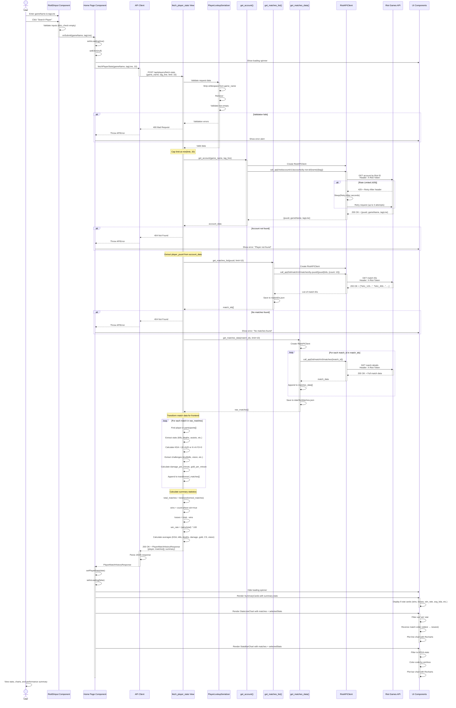
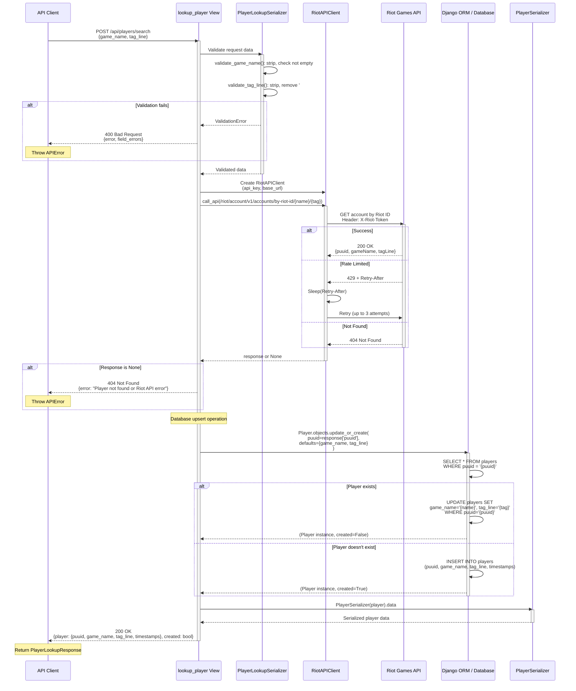
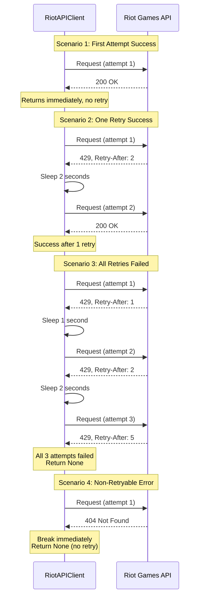
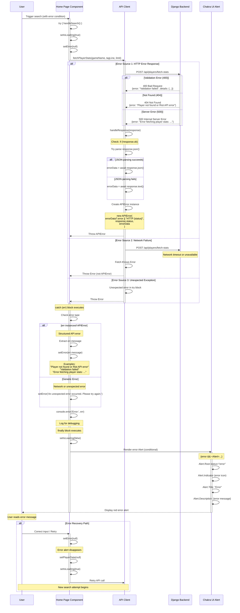
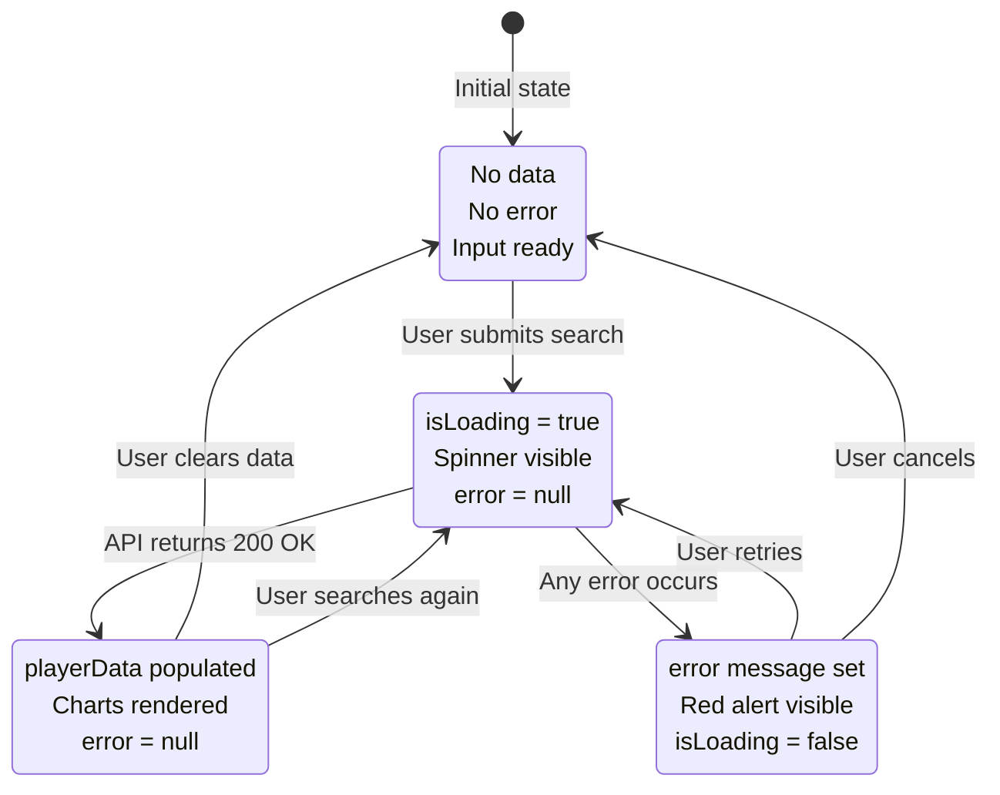
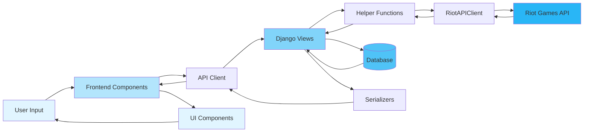

# GameTrack Sequence Diagrams

This document contains comprehensive sequence diagrams for all major workflows in the GameTrack project, showing component interactions, data flows, and error handling.

---

## 1. Complete Player Stats Search Flow (PRIMARY)

This is the main user journey through the application, from entering a Riot ID to viewing match statistics and charts.

**Key Features**:
- Full end-to-end flow from user input to data visualization
- Three sequential Riot API calls (account → match IDs → match details)
- Data transformation and summary statistics calculation
- Fresh data fetching (no database caching in this flow)



---

## 2. Player Lookup Only Flow

This flow handles looking up a player by Riot ID and creating/updating the player record in the database without fetching match history.

**Key Features**:
- Single Riot API call for account lookup
- Database upsert operation (create or update)
- Returns player info + created flag
- Used by `searchPlayerAndGetMatches()` composite method



---

## 3. Match History Retrieval with Database Caching

This flow demonstrates the performance-optimized match history retrieval that checks the database cache before making external API calls.

**Key Features**:
- Player must already exist in database
- Check cache for each match before fetching from Riot API
- Partial cache support (some cached, some fresh)
- Transaction-wrapped database operations for atomicity
- Significantly faster for repeat queries

```mermaid
sequenceDiagram
    participant APIClient as API Client
    participant DjangoView as get_player_matches View
    participant DB as Django ORM / Database
    participant RiotAPI as RiotAPIClient
    participant Riot as Riot Games API
    participant Serializer as Serializers

    APIClient->>DjangoView: GET /api/players/{puuid}/matches?limit=10
    activate DjangoView

    DjangoView->>DjangoView: Extract limit from query params
    Note over DjangoView: limit = min(limit, 20)

    DjangoView->>DB: Player.objects.get(puuid=puuid)
    activate DB

    alt Player not found
        DB-->>DjangoView: Player.DoesNotExist
        DjangoView-->>APIClient: 404 Not Found<br/>{error: "Player not found. Please search first."}
    end

    DB-->>DjangoView: Player instance
    deactivate DB

    DjangoView->>RiotAPI: Create RiotAPIClient
    DjangoView->>RiotAPI: call_api(/lol/match/v5/matches/by-puuid/{puuid}/ids, {count: limit})
    activate RiotAPI
    RiotAPI->>Riot: GET match IDs
    activate Riot
    Riot-->>RiotAPI: 200 OK + match_ids[]
    deactivate Riot
    RiotAPI-->>DjangoView: match_ids[]
    deactivate RiotAPI

    alt No match IDs
        DjangoView-->>APIClient: 404 Not Found<br/>{error: "No matches found"}
    end

    Note over DjangoView: Begin database transaction
    DjangoView->>DB: BEGIN TRANSACTION
    activate DB

    DjangoView->>DjangoView: match_stats_list = []

    loop For each match_id in match_ids
        Note over DjangoView: Check database cache first
        DjangoView->>DB: PlayerMatchStats.objects.filter(<br/>  player=player,<br/>  match__match_id=match_id<br/>).first()

        alt Cache HIT
            DB-->>DjangoView: Existing PlayerMatchStats
            Note over DjangoView: Use cached data
            DjangoView->>DjangoView: Append to match_stats_list
            Note over DjangoView: Skip API call for this match
        else Cache MISS
            DB-->>DjangoView: None

            Note over DjangoView: Fetch from Riot API
            DjangoView->>RiotAPI: call_api(/lol/match/v5/matches/{match_id})
            activate RiotAPI
            RiotAPI->>Riot: GET match details
            activate Riot
            Riot-->>RiotAPI: 200 OK + match_data
            deactivate Riot
            RiotAPI-->>DjangoView: match_data
            deactivate RiotAPI

            alt API call failed
                Note over DjangoView: Continue to next match
            end

            Note over DjangoView: Create/update Match record
            DjangoView->>DB: Match.objects.update_or_create(<br/>  match_id=match_id,<br/>  defaults={game_creation, duration, mode, type, raw_data}<br/>)
            DB->>DB: SELECT/INSERT/UPDATE matches
            DB-->>DjangoView: (Match instance, created)

            Note over DjangoView: Find player in participants
            DjangoView->>DjangoView: Extract player_data from participants[]

            alt Player not in match
                Note over DjangoView: Continue to next match
            end

            Note over DjangoView: Extract all stats from player_data
            DjangoView->>DjangoView: Extract kills, deaths, assists, win, champion
            DjangoView->>DjangoView: Extract challenges (multikills, vision, etc.)
            DjangoView->>DjangoView: Extract combat, economy stats

            Note over DjangoView: Create PlayerMatchStats record
            DjangoView->>DB: PlayerMatchStats.objects.create(<br/>  player=player, match=match,<br/>  kills, deaths, assists, win,<br/>  champion_id, champion_name,<br/>  all other stats...<br/>)
            DB->>DB: Calculate KDA in save() method
            Note over DB: kda = (K+A)/D or K+A if D=0
            DB->>DB: INSERT INTO player_match_stats
            DB-->>DjangoView: stats instance

            DjangoView->>DjangoView: Append stats to match_stats_list
        end
    end

    DjangoView->>DB: COMMIT TRANSACTION
    Note over DB: All changes committed atomically
    deactivate DB

    alt No match stats retrieved
        DjangoView-->>APIClient: 200 OK with empty matches[]
    end

    Note over DjangoView: Calculate summary statistics
    DjangoView->>DjangoView: Calculate total_matches, wins, losses
    DjangoView->>DjangoView: Calculate win_rate = (wins/total) * 100
    DjangoView->>DjangoView: Calculate averages (KDA, kills, deaths, damage, gold, CS, vision)

    DjangoView->>Serializer: PlayerSerializer(player).data
    activate Serializer
    Serializer-->>DjangoView: Serialized player
    deactivate Serializer

    DjangoView->>Serializer: PlayerMatchStatsSerializer(match_stats_list, many=True).data
    activate Serializer
    Note over Serializer: Includes nested match data:<br/>match_id, game_datetime,<br/>game_duration, game_mode
    Serializer-->>DjangoView: Serialized matches
    deactivate Serializer

    DjangoView-->>APIClient: 200 OK<br/>PlayerMatchHistoryResponse<br/>{player, matches[], total_matches, summary}
    deactivate DjangoView
```



---

## 4. Rate Limit Handling & Retry Logic

This diagram shows the critical retry logic in `RiotAPIClient.call_api()` that handles Riot API rate limiting.

**Key Features**:
- Up to 3 retry attempts per request
- Respects `Retry-After` header from Riot API
- Handles both per-second and per-2-minute rate limits
- Exponential backoff via Retry-After values

```mermaid
sequenceDiagram
    participant Caller as Caller (View/Helper)
    participant RiotAPI as RiotAPIClient
    participant Time as time.sleep()
    participant Riot as Riot Games API

    Caller->>RiotAPI: call_api(endpoint, params, headers, method)
    activate RiotAPI

    Note over RiotAPI: Construct full URL<br/>Add X-Riot-Token header

    loop Retry loop: attempt = 0 to 2 (max 3 attempts)
        Note over RiotAPI: Attempt #{attempt + 1}

        RiotAPI->>Riot: HTTP Request<br/>{method} {url}<br/>Headers: X-Riot-Token
        activate Riot

        alt Success (200 OK)
            Riot-->>RiotAPI: 200 OK + JSON response
            deactivate Riot
            RiotAPI->>RiotAPI: Parse response.json()
            RiotAPI-->>Caller: Return parsed JSON
            Note over Caller: Success - exit function

        else Rate Limited (429)
            Riot-->>RiotAPI: 429 Too Many Requests<br/>Headers: {Retry-After: X}
            deactivate Riot

            Note over RiotAPI: Extract Retry-After header
            RiotAPI->>RiotAPI: retry_after = int(headers.get('Retry-After', 1))

            Note over RiotAPI,Time: Respect rate limit by sleeping
            RiotAPI->>Time: sleep(retry_after seconds)
            activate Time
            Note over Time: Thread blocks for {retry_after}s<br/>Typical values: 1-120 seconds
            Time-->>RiotAPI: Wake up
            deactivate Time

            Note over RiotAPI: Continue to next iteration<br/>Will retry the same request

        else Client Error (4xx) or Server Error (5xx)
            Riot-->>RiotAPI: 4xx or 5xx error
            deactivate Riot
            Note over RiotAPI: Non-retryable error
            RiotAPI->>RiotAPI: Break retry loop
            Note over RiotAPI: Exit loop, return None
        end
    end

    alt All retries exhausted OR non-retryable error
        RiotAPI-->>Caller: Return None
        deactivate RiotAPI
        Note over Caller: Handle None response<br/>(return 404/500 error)
    end
```

**Rate Limit Scenarios**:



---

## 5. Error Handling & User Feedback Flow

This diagram shows how errors from any source are caught, transformed, and displayed to the user with appropriate feedback.

**Key Features**:
- Multiple error sources (validation, network, API, server)
- APIError custom error class for structured errors
- Type-safe error handling in TypeScript
- User-friendly error messages in UI



**Error Message Mapping**:

| Error Type | Status | Source | User Message |
|------------|--------|--------|--------------|
| Validation Error | 400 | Backend validation | Field-specific errors from serializer |
| Player Not Found | 404 | Riot API / Database | "Player not found or Riot API error" |
| No Matches | 404 | Riot API | "No matches found for this player" |
| Rate Limit Exhausted | 500 | Riot API (after retries) | "Error fetching player stats: ..." |
| Server Error | 500 | Backend exception | "Error fetching player stats: {details}" |
| Network Error | - | Fetch API | "An unexpected error occurred. Please try again." |
| Parse Error | - | JSON.parse() | "An unexpected error occurred. Please try again." |

**Error State Flow**:



---

## Workflow Summary

### Data Flow Overview



### Key Timing Characteristics

| Workflow | API Calls | DB Queries | Typical Duration |
|----------|-----------|------------|------------------|
| **Complete Player Stats Search** | 3 (account + match IDs + 10 matches) | 0 (no caching) | 3-10 seconds |
| **Player Lookup Only** | 1 (account) | 1 upsert | 0.5-2 seconds |
| **Match History (Full Cache)** | 1 (match IDs only) | ~20 SELECT queries | 0.2-1 second |
| **Match History (No Cache)** | 12 (match IDs + 10 matches + match upsert) | ~40 INSERT/SELECT queries | 3-8 seconds |
| **Match History (Partial Cache)** | 1 + N (N = uncached matches) | Mixed SELECT/INSERT | 1-5 seconds |

### Caching Strategy

- **Workflow 1 (fetch_player_stats)**: No database caching, always fetches fresh data
- **Workflow 3 (get_player_matches)**: Database caching with smart cache checking
- **Cache Key**: `(player_puuid, match_id)` unique constraint
- **Cache Invalidation**: None (data persists indefinitely)
- **Cache Benefits**:
  - Reduces Riot API calls by ~90% for repeat queries
  - Faster response times (0.2s vs 5s)
  - Reduces risk of rate limiting

### Rate Limiting Details

**Riot API Limits**:
- Development Key: 20 requests/second, 100 requests/2 minutes
- Production Key: Higher limits (varies by tier)

**GameTrack Handling**:
- **Reactive**: Responds to 429 errors, doesn't prevent them
- **Retry Strategy**: Up to 3 attempts with sleep between
- **Sleep Duration**: Dictated by `Retry-After` header (1-120 seconds)
- **Fallback**: Returns None if all retries fail

**Potential Issues**:
- Fetching 10 matches = 12 API calls (can hit rate limit)
- No request queuing or proactive throttling
- Each retry adds significant delay to user experience

### Transaction Boundaries

**Workflow 3 Match Processing**:
```python
with transaction.atomic():
    for match_id in match_ids:
        # Check cache
        # Fetch from API if needed
        # Create Match record
        # Create PlayerMatchStats record
# COMMIT - All or nothing
```

**Benefits**:
- Ensures database consistency
- Prevents partial data on errors
- Atomic rollback on exceptions

---

## Notes

- **Async Operations**: All HTTP requests (frontend fetch, backend requests) are asynchronous
- **Sync Operations**: Database queries, data transformation, calculations are synchronous
- **Error Propagation**: Errors bubble up from RiotAPI → Helpers → Views → APIClient → Components → UI
- **Type Safety**: TypeScript interfaces ensure type checking across frontend/backend boundary
- **Idempotency**: Player lookup is idempotent (update_or_create), match fetching is idempotent (check cache first)

